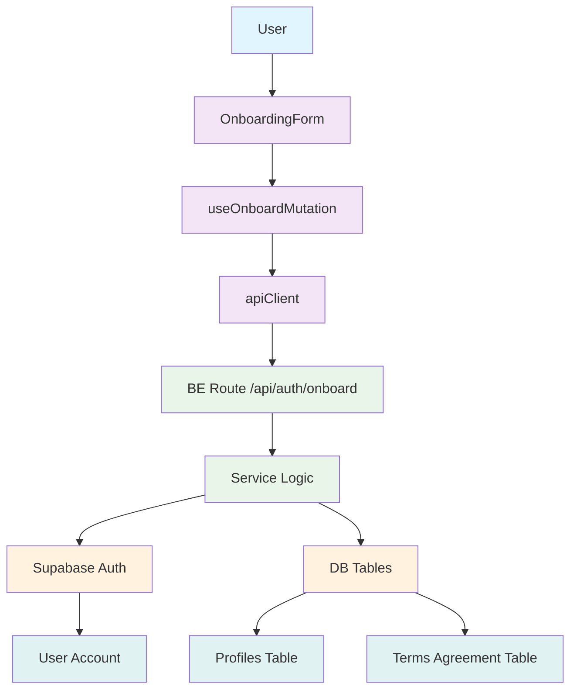

# Feature #1: 역할 선택 & 온보딩 모듈 설계

## 1. 요구사항 분석

기존 유스케이스 문서 (/docs/001/spec.md)의 요구사항에 따르면, 역할 선택 & 온보딩 기능은 다음을 포함합니다:

- 사용자 이메일/비밀번호 회원가입
- 역할 선택 (Learner / Instructor)
- 프로필 정보 (이름, 휴대폰번호) 입력
- 약관 동의 처리
- Supabase Auth 계정 생성
- 역할 및 프로필 정보 DB 저장
- 권한 토큰 발급
- 역할에 따른 첫 화면 안내

## 2. 기존 코드베이스 분석

기존 auth 기능은 다음과 같은 구조를 따르고 있음:
- Context: 사용자 상태 관리
- Hooks: 사용자 정보 접근
- Server utilities: 서버 사이드 사용자 정보 로드

기존 example 기능은 다음과 같은 구조를 따르고 있음:
- Backend: schema.ts, service.ts, route.ts, error.ts
- Lib: DTO 재노출
- Components: UI 컴포넌트
- Hooks: React Query 훅
- Types 정의

## 3. 모듈 설계

### 3.1 프론트엔드 모듈

#### 3.1.1 `src/features/auth/components/onboarding-form.tsx`
- 역할 선택 및 회원가입 폼 UI
- 이메일, 비밀번호, 역할, 프로필 정보 입력
- 약관 동의 UI
- Zod 스키마 기반 유효성 검사

#### 3.1.2 `src/features/auth/hooks/useOnboardMutation.ts`
- 회원가입 API 호출을 위한 React Query mutation hook
- 폼 데이터 전송 및 오류 처리

#### 3.1.3 `src/features/auth/pages/onboarding.tsx`
- 온보딩 폼을 렌더링하는 페이지 컴포넌트

### 3.2 백엔드 모듈

#### 3.2.1 `src/features/auth/backend/schema.ts`
- 요청/응답 Zod 스키마 정의
  - `OnboardRequestSchema`: 회원가입 요청 스키마
  - `OnboardResponseSchema`: 회원가입 응답 스키마
  - `UserProfileSchema`: 사용자 프로필 스키마
  - `TermsAgreementSchema`: 약관 동의 스키마

#### 3.2.2 `src/features/auth/backend/service.ts`
- 사용자 등록 비즈니스 로직
- Supabase Auth 계정 생성
- 역할 및 프로필 정보 저장
- 약관 동의 이력 저장
- 인증 에러 처리

#### 3.2.3 `src/features/auth/backend/route.ts`
- `/api/auth/onboard` POST 엔드포인트
- 요청 파싱 및 검증
- 서비스 로직 호출
- 응답 포맷팅

#### 3.2.4 `src/features/auth/backend/error.ts`
- 회원가입 관련 에러 코드 정의

### 3.3 공통 모듈

#### 3.3.1 `src/features/auth/lib/dto.ts`
- 백엔드 스키마 재노출 (React Query에서 사용)

#### 3.3.2 `src/features/auth/types.ts`
- 공통 타입 정의 (UserType, Profile 등)

### 3.4 데이터베이스 모듈

#### 3.4.1 `supabase/migrations/0001_create_profiles_table.sql`
- 사용자 프로필 테이블 생성 마이그레이션 파일

#### 3.4.2 `supabase/migrations/0002_create_terms_agreement_table.sql`
- 약관 동의 이력 테이블 생성 마이그레이션 파일

## 4. 아키텍처 다이어그램

## 5. 구현 계획

### 5.1 프론트엔드 (Presentation Layer)

#### 5.1.1 OnboardingForm 컴포넌트
- **위치**: `src/features/auth/components/onboarding-form.tsx`
- **의존성**: `react-hook-form`, `zod`, `@/lib/remote/api-client`, `shadcn-ui`
- **기능**:
  - 이메일/비밀번호/역할/프로필 정보/약관 동의 입력 UI
  - Zod 스키마 기반 유효성 검사
  - 폼 제출 처리
- **QA 테스트 요소**:
  - 필수 필드 검증 테스트
  - 이메일 형식 검증 테스트
  - 비밀번호 규칙 검증 테스트
  - 역할 선택 기능 테스트
  - 약관 동의 체크박스 테스트
  - API 에러 처리 테스트

#### 5.1.2 useOnboardMutation 훅
- **위치**: `src/features/auth/hooks/useOnboardMutation.ts`
- **의존성**: `@tanstack/react-query`, `@/lib/remote/api-client`
- **기능**:
  - 회원가입 API 호출
  - 로딩/성공/에러 상태 관리
- **QA 테스트 요소**:
  - API 호출 성공 시나리오 테스트
  - API 에러 처리 테스트
  - 중복 이메일 처리 테스트
  - 유효성 검사 실패 처리 테스트

### 5.2 백엔드 (Business Logic Layer)

#### 5.2.1 스키마 정의
- **위치**: `src/features/auth/backend/schema.ts`
- **의존성**: `zod`
- **기능**:
  - 요청/응답 데이터 구조 정의
  - 유효성 검사 규칙 정의
- **Unit 테스트**:
  - 스키마 유효성 검사 테스트
  - 잘못된 데이터에 대한 검증 테스트
  - 올바른 데이터에 대한 파싱 테스트

#### 5.2.2 서비스 로직
- **위치**: `src/features/auth/backend/service.ts`
- **의존성**: `@supabase/supabase-js`, `zod`
- **기능**:
  - 사용자 등록 비즈니스 로직
  - Auth 계정 생성
  - 프로필 저장
  - 약관 동의 저장
- **Unit 테스트**:
  - 사용자 등록 성공 시나리오 테스트
  - 중복 이메일 처리 테스트
  - 역할 저장 테스트
  - 프로필 정보 저장 테스트
  - 약관 동의 이력 저장 테스트
  - 에러 발생 시 대응 테스트

#### 5.2.3 라우트 정의
- **위치**: `src/features/auth/backend/route.ts`
- **의존성**: `hono`, `@/features/auth/backend/service`
- **기능**:
  - `/api/auth/onboard` POST 라우트 정의
  - 요청 파싱 및 검증
  - 서비스 호출
  - 응답 포맷팅
- **Unit 테스트**:
  - 유효한 요청 처리 테스트
  - 유효성 검사 실패 처리 테스트
  - 서비스 로직 실패 처리 테스트
  - 정상 응답 포맷 테스트

#### 5.2.4 에러 정의
- **위치**: `src/features/auth/backend/error.ts`
- **의존성**: 없음
- **기능**:
  - 회원가입 관련 에러 코드 정의
- **Unit 테스트**:
  - 에러 코드 유효성 테스트
  - 에러 타입 정의 테스트

### 5.3 데이터베이스 마이그레이션

#### 5.3.1 프로필 테이블 마이그레이션
- **위치**: `supabase/migrations/0001_create_profiles_table.sql`
- **기능**:
  - 사용자 프로필 테이블 생성
  - id, email, role, full_name, phone, created_at, updated_at 컬럼

#### 5.3.2 약관 동의 테이블 마이그레이션
- **위치**: `supabase/migrations/0002_create_terms_agreement_table.sql`
- **기능**:
  - 약관 동의 이력 테이블 생성
  - user_id, terms_type, agreed_at, ip_address 컬럼

### 5.4 공통 레이어

#### 5.4.1 DTO 재노출
- **위치**: `src/features/auth/lib/dto.ts`
- **기능**:
  - 백엔드 스키마 재노출
  - 프론트엔드에서 스키마 재사용 가능하게

#### 5.4.2 타입 정의
- **위치**: `src/features/auth/types.ts`
- **기능**:
  - 공통 타입 정의
  - User, Profile, Role 타입 정의