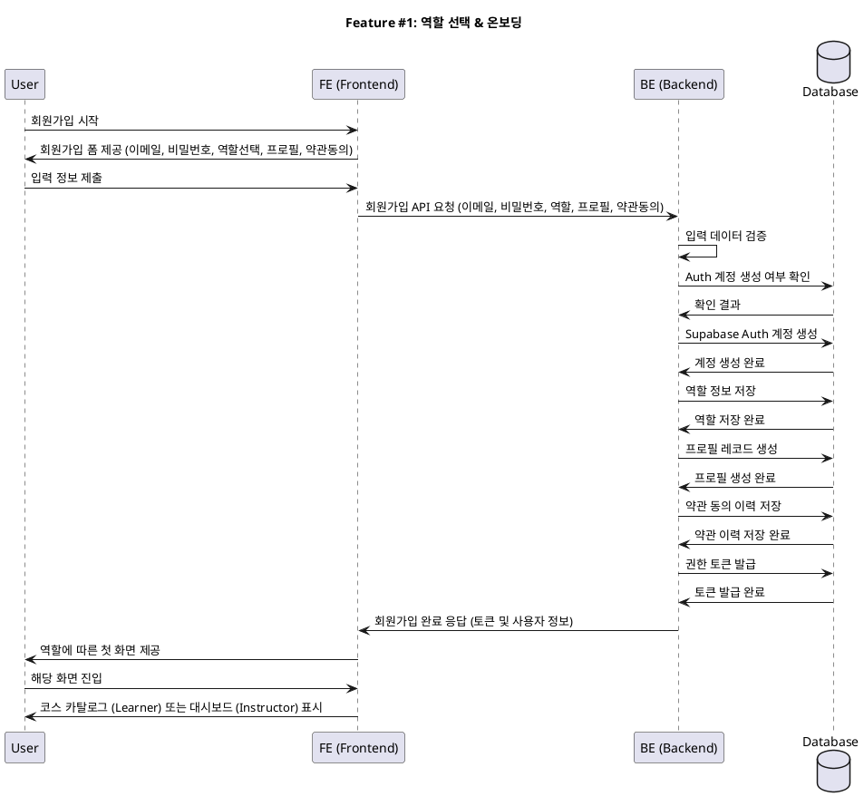

# Feature #1: 역할 선택 & 온보딩 (Role Selection & Onboarding)

## Primary Actor
- 신규 사용자 (Learner 또는 Instructor)

## Precondition (사용자 관점)
- 사용자는 서비스에 처음 방문하여 회원가입을 시도한다.
- 사용자는 이메일 계정을 소유하고 있다.
- 사용자는 Learner 또는 Instructor 중 하나의 역할을 선택할 수 있다.

## Trigger
- 사용자가 홈페이지의 "회원가입" 또는 "시작하기" 버튼을 클릭한다.

## Main Scenario
1. 사용자는 이메일, 비밀번호를 입력하고 역할(Learner/Instructor)을 선택한다.
2. 사용자는 공통 프로필 정보(이름, 휴대폰번호)를 입력한다.
3. 사용자는 서비스 이용약관, 개인정보처리방침 등에 동의한다.
4. 시스템은 사용자 입력 정보를 검증한다.
5. 시스템은 Supabase를 통해 Auth 계정을 생성한다.
6. 시스템은 사용자의 역할을 저장한다. (`role=learner | instructor`)
7. 시스템은 프로필 레코드를 생성한다.
8. 시스템은 약관 동의 이력을 저장한다.
9. 시스템은 기본 권한 토큰을 발급한다.
10. 시스템은 사용자의 역할에 따라 다음 화면으로 안내한다:
    - Learner인 경우: 코스 카탈로그 첫 진입
    - Instructor인 경우: 대시보드 첫 진입

## Edge Cases
- **이메일 중복**: 이미 등록된 이메일인 경우, 중복 계정 생성 오류를 발생시키고 사용자에게 알림
- **유효성 검사 실패**: 이메일 형식 오류, 비밀번호 규칙 위반 등에 대해 적절한 오류 메시지 표시
- **약관 미동의**: 필수 약관에 동의하지 않은 경우, 회원가입 진행 차단
- **네트워크 오류**: 계정 생성 중 네트워크 오류 발생 시, 재시도 안내 또는 오류 메시지 표시

## Business Rules
- 하나의 이메일로는 하나의 계정만 생성 가능하다.
- 역할 선택은 회원가입 시 1회만 가능하며, 이후 변경은 관리자 권한이 필요하다.
- 필수 프로필 정보(이름, 휴대폰번호)는 모두 입력되어야 한다.
- 모든 약관 동의는 필수이며, 일부라도 미동의 시 회원가입 불가.
- Instructor 역할은 추가 검증 절차를 필요로 할 수 있다 (추후 확장).

## Sequence Diagram

