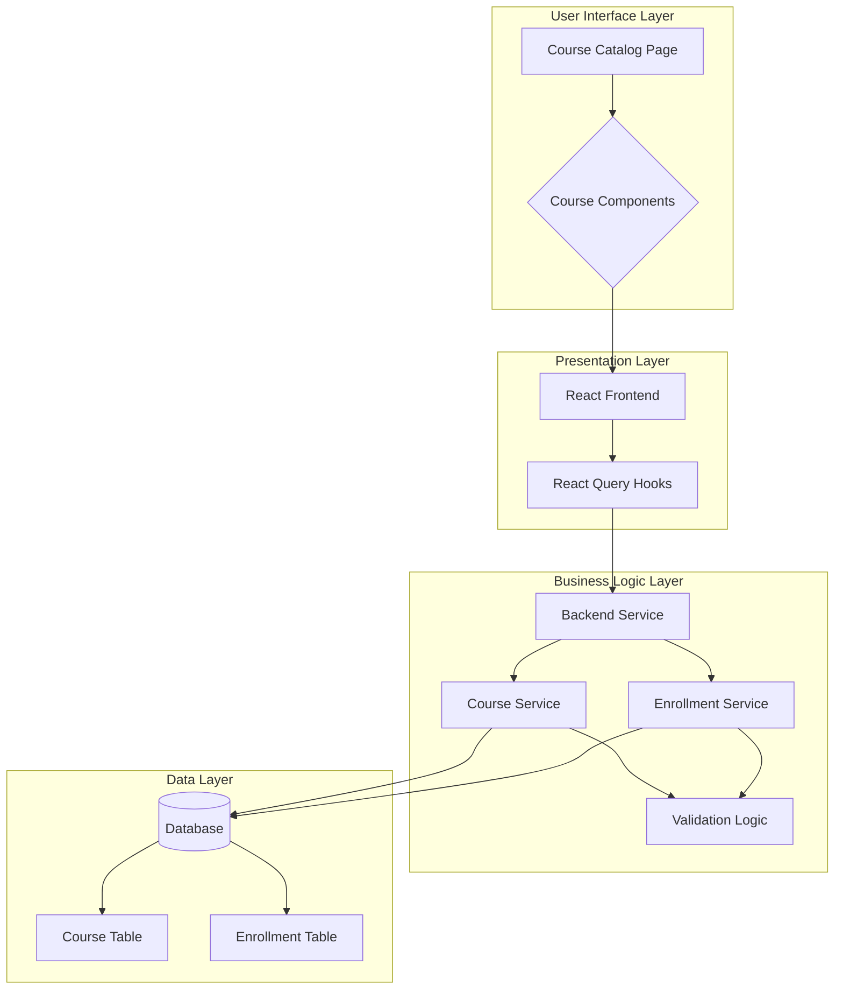

# 코스 탐색 및 수강신청 기능 설계 문서

## 1. 개요

이 문서는 수강생이 코스를 탐색하고 수강신청할 수 있도록 하는 기능을 구현하기 위한 모듈화 설계를 설명합니다. 코스 목록 조회, 검색/필터링, 상세 정보 조회, 수강신청 등의 기능을 포함합니다.

### 1.1 모듈 목록

| 모듈 이름 | 위치 | 간략한 설명 |
|-----------|------|-------------|
| course-exploration | `src/features/course-exploration` | 수강생이 코스를 탐색하는 기능을 담당 |
| course-enrollment | `src/features/course-enrollment` | 수강신청 로직 및 관련 검증을 담당 |
| course-api | `src/features/course/backend` | 코스 관련 API 라우트 및 비즈니스 로직 |
| course-dto | `src/features/course/lib` | 코스 관련 DTO 및 타입 정의 |
| course-ui | `src/features/course/components` | 코스 관련 UI 컴포넌트 |
| course-hooks | `src/features/course/hooks` | 코스 관련 React Query 훅 |

## 2. 다이어그램

## 3. 구현 계획

### 3.1 Course API 모듈 (`src/features/course/backend`)

#### 3.1.1 API 라우트 (`route.ts`)
- `/api/courses`: 코스 목록 조회 (필터/검색/정렬 포함)
- `/api/courses/:id`: 코스 상세 정보 조회
- `/api/courses/:id/enroll`: 수강신청 API
- 서비스 검증 로직을 포함하여 엔드포인트별로 정의

#### 3.1.2 비즈니스 로직 (`service.ts`)
- `getCourses()`: 조건에 맞는 게시된 코스 목록 조회
- `getCourseById()`: ID로 코스 상세 정보 조회
- `createEnrollment()`: 수강신청 생성 및 검증 로직
- 중복 수강신청 방지, 코스 상태 검증 등 비즈니스 규칙 반영

#### 3.1.3 스키마 정의 (`schema.ts`)
- Zod를 사용한 요청/응답 스키마 정의
- 코스 목록 조회 파라미터 검증 스키마
- 수강신청 요청 스키마
- 응답 데이터 검증 스키마

#### 3.1.4 에러 정의 (`error.ts`)
- 코스 관련 에러 코드 정의
- 코스 없음, 수강신청 불가 상태, 중복 수강신청 등 에러 코드 정의

### 3.2 Course DTO 모듈 (`src/features/course/lib`)

#### 3.2.1 타입 정의
- 공통 사용을 위한 코스 관련 타입 및 인터페이스 정의
- 프론트엔드 및 백엔드에서 재사용 가능한 타입 제공

### 3.3 Course UI 모듈 (`src/features/course/components`)

#### 3.3.1 코스 카탈로그 컴포넌트
- 필터 및 검색 UI
- 코스 목록 카드 표시
- 정렬 기능

#### 3.3.2 코스 상세 컴포넌트
- 코스 상세 정보 표시
- 수강신청 버튼 및 상태 표시

#### 3.3.3 수강신청 폼 컴포넌트
- 수강신청 과정을 위한 UI 컴포넌트
- 에러 메시지 표시

### 3.4 Course Hooks 모듈 (`src/features/course/hooks`)

#### 3.4.1 React Query 훅
- `useCoursesQuery()`: 코스 목록 조회 훅
- `useCourseQuery()`: 코스 상세 조회 훅
- `useEnrollCourseMutation()`: 수강신청 훅
- 캐싱 및 로딩 상태 관리

### 3.5 Course Exploration 모듈 (`src/features/course-exploration`)

#### 3.5.1 탐색 기능
- 검색, 필터링, 정렬 로직
- 검색 인터페이스 및 상태 관리

### 3.6 Course Enrollment 모듈 (`src/features/course-enrollment`)

#### 3.6.1 수강신청 기능
- 수강신청 상태 관리
- 수강신청 검증 로직
- 수강신청 결과 처리

## 4. 구현 상세

### 4.1 Presentation Layer (프론트엔드)

#### 4.1.1 페이지 구성
`src/app/courses/page.tsx`
- 코스 카탈로그 페이지
- `Promise` 타입 사용 (AGENTS.md의 Next.js 규칙 준수)
- 검색, 필터, 정렬 UI 포함

#### 4.1.2 컴포넌트 구성
- `CourseList` 컴포넌트: 코스 목록 표시
- `CourseCard` 컴포넌트: 개별 코스 카드
- `CourseFilters` 컴포넌트: 검색 및 필터 UI
- `EnrollmentButton` 컴포넌트: 수강신청 버튼

#### 4.1.3 QA 테스트 시트
- [ ] 코스 목록이 게시 상태의 코스만 표시되는가?
- [ ] 검색어 입력 시 정상적으로 필터링 되는가?
- [ ] 카테고리/난이도 필터가 작동하는가?
- [ ] 정렬 기능(최신순/인기순)이 작동하는가?
- [ ] 코스 상세 정보가 정상적으로 표시되는가?
- [ ] 수강신청 버튼이 게시된 코스에만 활성화 되는가?
- [ ] 중복 수강신청이 방지되는가?
- [ ] 수강신청 후 사용자에게 피드백이 제공되는가?

### 4.2 Business Logic Layer (백엔드)

#### 4.2.1 서비스 로직
- `src/features/course/backend/service.ts`
- 코스 목록 조회: published 상태만 반환
- 코스 상세 조회: ID 기반 검색 및 상태 검증
- 수강신청 생성: 중복 검증, 코스 상태 검증

#### 4.2.2 에러 처리
- 수강신청 불가 코스에 대한 에러 처리
- 중복 수강신청에 대한 에러 처리
- 인증되지 않은 사용자 접근 처리

#### 4.2.3 Unit Tests
- `src/features/course/backend/__tests__/service.test.ts`
- 코스 목록 조회 테스트
- 코스 상세 조회 테스트
- 수강신청 생성 테스트
- 수강신청 유효성 검사 테스트
- 예외 케이스 테스트 (게시되지 않은 코스, 중복 수강신청 등)

### 4.3 Data Layer (데이터베이스)

#### 4.3.1 데이터베이스 쿼리
- 코스 목록 조회 쿼리 (필터/정렬 포함)
- 코스 상세 정보 쿼리
- 수강신청 생성 쿼리
- 중복 수강신청 확인 쿼리

#### 4.3.2 데이터 검증
- 코스 상태 확인 (published 상태만 수강신청 가능)
- 사용자 역할 확인 (learner만 수강신청 가능)
- 수강 정원 초과 방지

## 5. 공통 모듈 및 제네릭 고려

### 5.1 재사용 가능한 모듈
- 페이징 및 필터링 유틸리티
- 상태 관리 Store (zustand 사용)
- 공통 에러 처리 컴포넌트
- API 요청 클라이언트 (`@/lib/remote/api-client`)

### 5.2 제네릭 타입
- `PaginatedResponse<T>` 제네릭 타입
- 코스/수강 관련 공통 타입 정의