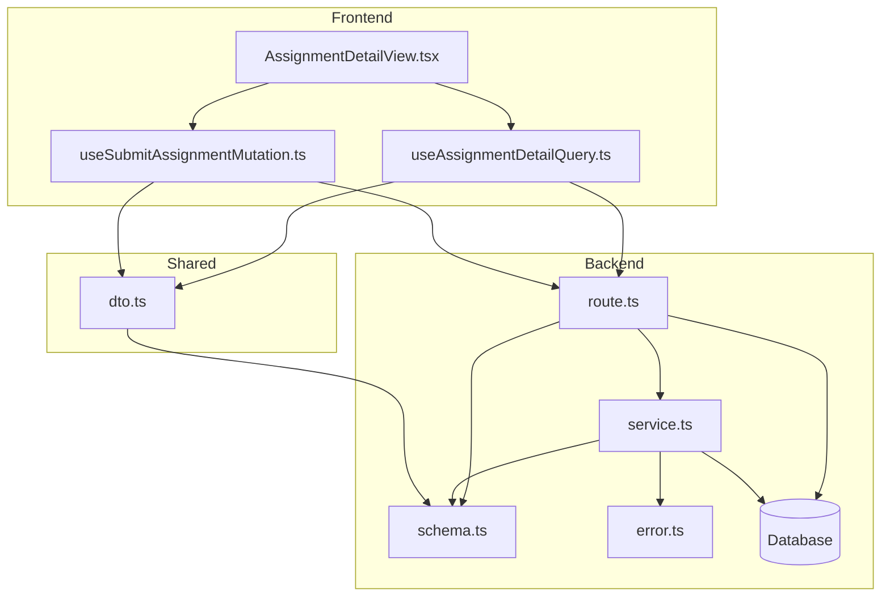

# 과제 상세 열람 기능 모듈 설계

## 개요

이 문서는 과제 상세 열람 기능의 모듈화 설계를 설명합니다. AGENTS.md의 디렉토리 구조를 따르며, 유스케이스 문서(spec.md)에 명시된 요구사항을 충족하는 모듈을 설계합니다.

### Frontend (Presentation Layer)

- `src/features/assignment/components/AssignmentDetailView.tsx`: Assignment 상세 정보를 표시하는 컴포넌트
- `src/features/assignment/hooks/useAssignmentDetailQuery.ts`: Assignment 상세 정보를 가져오는 React Query 훅
- `src/features/assignment/hooks/useSubmitAssignmentMutation.ts`: Assignment 제출을 처리하는 React Query 뮤테이션 훅 (과제 제출 기능 포함)

### Backend (Business Logic & API Layer)

- `src/features/assignment/backend/route.ts`: Assignment 관련 API 라우트 정의
- `src/features/assignment/backend/service.ts`: Assignment 관련 비즈니스 로직 구현
- `src/features/assignment/backend/schema.ts`: API 요청/응답 스키마 정의 (Zod 사용)
- `src/features/assignment/backend/error.ts`: Assignment 관련 에러 코드 정의

### Shared (DTO & Types)

- `src/features/assignment/lib/dto.ts`: FE와 BE 간 공유되는 타입 정의 (schema 재노출)

## Diagram

## Implementation Plan

### Frontend Implementation

1. `AssignmentDetailView.tsx`:
   - "use client" 지시문 포함
   - `useAssignmentDetailQuery` 훅을 사용하여 과제 상세 정보를 가져옴
   - 과제 설명, 마감일, 점수 비중, 정책 등을 표시
   - 제출 UI(text+link 입력란)를 표시
   - 과제의 `closed` 상태 여부에 따라 제출 버튼 활성화/비활성화 처리
   - Edge case 처리: 코스 미등록, 과제 미게시, 유효하지 않은 ID 등에 대한 에러 표시

2. `useAssignmentDetailQuery.ts`:
   - `@/lib/remote/api-client`를 통해 BE API 호출
   - Assignment ID를 파라미터로 전달
   - `react-query`의 `useQuery`를 사용하여 캐싱 및 상태 관리
   - API 응답을 `AssignmentResponseSchema`로 파싱

3. `useSubmitAssignmentMutation.ts`:
   - `@/lib/remote/api-client`를 통해 BE API 호출
   - 과제 ID, 텍스트, 링크 정보를 전달
   - `react-query`의 `useMutation`을 사용하여 상태 관리
   - 제출 성공/실패에 따라 UI 업데이트

#### QA Sheet

- Assignment 상세 페이지가 정상적으로 표시되는가?
- 과제 정보(설명, 마감일, 점수 비중, 정책 등)가 정확히 표시되는가?
- 제출 UI가 정상적으로 표시되는가?
- 마감 상태에 따라 제출 버튼이 활성화/비활성화되는가?
- 미등록 코스/비공개 과제에 접근 시 적절한 에러 메시지를 표시하는가?
- 제출 기능이 정상적으로 작동하는가?
- 제출 후 상태가 업데이트되는가?

### Backend Implementation

1. `route.ts`:
   - `GET /assignments/:id` 엔드포인트 구현
   - `GET /assignments/:id/submission` 엔드포인트 구현 (과제 제출 관련)
   - `Hono` 프레임워크 사용
   - `withAppContext`, `withSupabase`, `errorBoundary` 미들웨어 사용

2. `service.ts`:
   - 사용자 인증 정보 확인 로직 구현
   - 사용자의 코스 등록 여부 검증 로직 구현
   - Assignment의 `published` 상태 확인 로직 구현
   - Assignment 상세 정보 조회 로직 구현
   - 제출 정보 조회/저장 로직 구현

3. `schema.ts`:
   - API 요청/응답 스키마 정의 (Zod 사용)
   - 과제 상세 응답 스키마
   - 제출 요청 스키마
   - 유효성 검사 로직 포함

4. `error.ts`:
   - Assignment 관련 에러 코드 정의
   - 코스 미등록, 과제 미게시, 유효하지 않은 ID 등에 대한 에러 코드 정의

#### Unit Tests

- Assignment 상세 정보 조회 서비스 로직 테스트
- 사용자 코스 등록 여부 검증 로직 테스트
- Assignment 상태 확인 로직 테스트
- 과제 제출 로직 테스트 (정상/비정상 시나리오)
- 스키마 유효성 검사 테스트