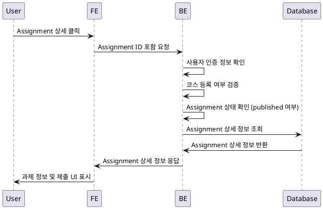

# 과제 상세 열람 유스케이스 (Learner)

## Primary Actor
Learner (수강생)

## Precondition
- 사용자는 로그인 상태이어야 한다.
- 사용자는 특정 코스에 등록된 상태이어야 한다.
- 열람하려는 과제가 현재 `published` 상태이어야 한다.

## Trigger
Learner가 내 코스 페이지에서 Assignment 목록 중 하나를 클릭하여 상세 페이지를 요청할 때.

## Main Scenario
1. Learner가 내 코스 → Assignment 목록 → 특정 Assignment 클릭
2. FE: Assignment ID를 포함한 요청을 BE에 전송
3. BE: 사용자 인증 정보 확인
4. BE: 사용자가 해당 코스에 등록되어 있는지 검증
5. BE: 해당 Assignment가 `published` 상태인지 확인
6. BE: Assignment 상세 정보(설명, 마감일, 점수 비중, 정책 등)를 DB에서 조회
7. BE: 응답으로 과제 상세 정보를 FE에 전달
8. FE: 과제 설명, 마감일, 점수 비중, 정책 등을 화면에 표시
9. FE: 제출 UI(text+link 입력란)를 화면에 노출
10. 과제의 `closed` 상태 여부에 따라 제출 버튼 활성화/비활성화 처리

## Edge Cases
- 사용자가 해당 코스에 등록되지 않은 경우: 접근 차단
- 과제가 `published` 상태가 아닌 경우: 접근 차단
- Assignment ID가 유효하지 않은 경우: 404 에러 반환
- 과제가 이미 마감된 경우: 제출 버튼 비활성화 안내 표시

## Business Rules
- Assignment 상태가 `published`인 경우에만 열람 가능
- `closed` 상태인 경우 제출 버튼은 비활성화
- 본인 코스 등록 여부를 반드시 검증해야 함

## Sequence Diagram
