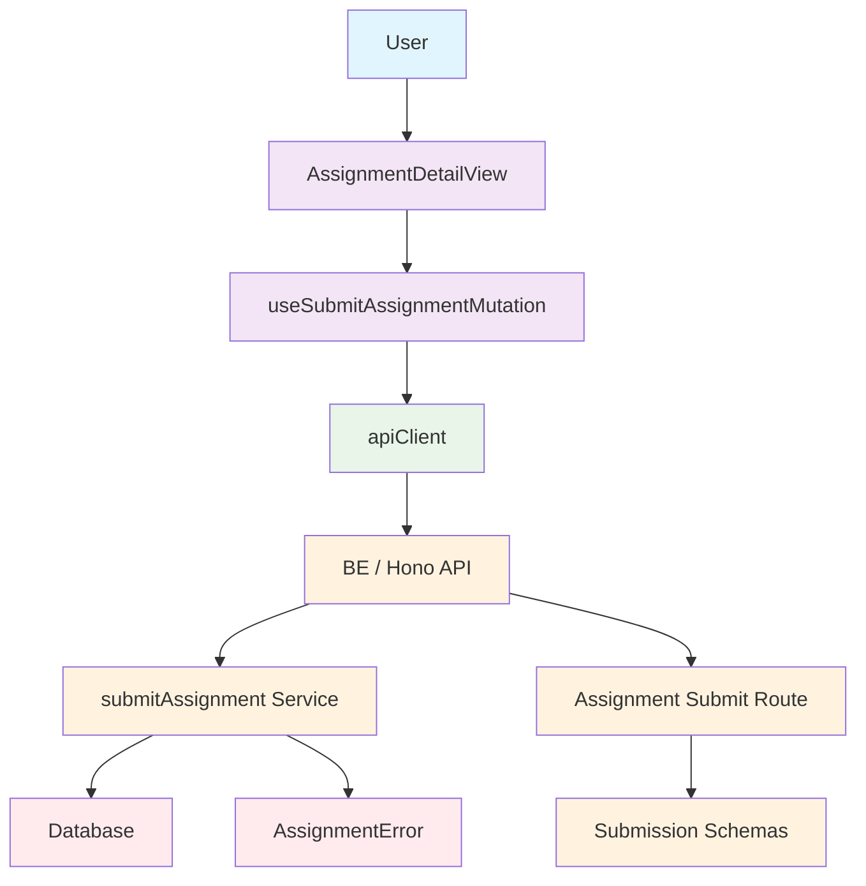

# 과제 제출 기능 모듈화 설계

## 1. 개요

이 문서는 과제 제출 유스케이스(4번 기능)를 구현하기 위한 최소한의 모듈화 설계를 설명합니다. 기존의 구현된 구조를 기반으로 하며, AGENTS.md의 파일 구조 규칙을 준수합니다.

### 모듈 목록 및 위치

| 모듈 이름 | 위치 | 간략한 설명 |
|----------|------|------------|
| AssignmentDetailView | `src/features/assignment/components/AssignmentDetailView.tsx` | 과제 상세 정보 표시 및 제출 UI 제공 |
| useSubmitAssignmentMutation | `src/features/assignment/hooks/useSubmitAssignmentMutation.ts` | 과제 제출 기능을 위한 React Query mutation 훅 |
| useAssignmentSubmissionQuery | `src/features/assignment/hooks/useAssignmentSubmissionQuery.ts` | 사용자 과제 제출 내역 조회 훅 |
| apiClient | `src/lib/remote/api-client.ts` | 과제 제출 API 요청 처리 |
| Assignment Submit Route | `src/features/assignment/backend/route.ts` | 과제 제출 API 엔드포인트 정의 |
| submitAssignment Service | `src/features/assignment/backend/service.ts` | 과제 제출 비즈니스 로직 처리 |
| Submission Schemas | `src/features/assignment/backend/schema.ts` | 과제 제출 관련 Zod 스키마 및 DTO 정의 |
| AssignmentError | `src/features/assignment/backend/error.ts` | 과제 제출 관련 에러 코드 및 클래스 정의 |

## 2. 다이어그램



## 3. Implementation Plan

### 3.1 Presentation Layer

- **파일**: `src/features/assignment/components/AssignmentDetailView.tsx`
- **기존 구현 활용**: 과제 제출 폼이 이미 존재하므로, 기존 폼에 마감일 정책 및 제출 상태 표시 기능 강화
- **Input 검증**: 
  - Text 필드는 공백만으로 이루어지면 안됨
  - Link 필드는 URL 형식이어야 함
- **UI/UX 개선**:
  - 마감일 초과 시 시각적 표시
  - 지각 제출 허용 여부 표시
  - 재제출 허용 여부 표시
  - 제출 상태(정상 제출/지각 제출/제출 불가) 표시

### 3.2 Hooks Layer

- **파일**: `src/features/assignment/hooks/useSubmitAssignmentMutation.ts`
- **기존 구현 확장**:
  - 제출 전에 Input 검증 로직 강화
  - mutation 성공/실패 시 적절한 사용자 피드백 제공
  - `onSuccess` 시 관련 쿼리 인вали데이션 확장

#### QA Sheet:
- Q: 제출 실패 시 어떤 에러 메시지를 사용자에게 보여줄까?
- A: 백엔드에서 반환된 에러 코드에 따라 사용자 친화적 메시지를 표시
- Q: 제출 중복 방지는 어떻게 처리할까?
- A: 버튼 비활성화 및 mutation.isPending 상태 활용

### 3.3 Remote Layer

- **파일**: `src/lib/remote/api-client.ts`
- **기존 구현 활용**: 과제 제출 API 엔드포인트 호출 시 인증 토큰 자동 추가

### 3.4 Backend Layer (Hono API)

- **파일**: `src/features/assignment/backend/route.ts`
- **기존 구현 확장**:
  - `/assignments/:assignmentId/submit` 엔드포인트에 대한 인증 확인 강화
  - 요청 본문에 대한 Zod 스키마 검증 강화

### 3.5 Service Layer

- **파일**: `src/features/assignment/backend/service.ts`
- **기존 구현 활용 및 확장**:
  - `submitAssignment` 함수에 대한 비즈니스 로직 구현
    1. Assignment 정보 확인 (published 상태 여부, 마감일 등)
    2. 사용자 코스 등록 여부 확인
    3. 마감일 정책 확인 (지각 제출 허용 여부)
    4. 재제출 정책 확인 (재제출 허용 여부)
    5. 기존 제출 내역 확인
    6. 제출 정보 저장 또는 업데이트
  - 유효성 검사 (Input 내용 검증)
  - 비즈니스 규칙에 따라 적절한 에러 반환

#### Unit Test:
```typescript
// submitAssignment 서비스 함수에 대한 유닛 테스트 예시
describe('submitAssignment', () => {
  it('should successfully submit assignment before due date', async () => {
    // 테스트 구현
  });

  it('should submit assignment as late when submitted after due date but late submission is allowed', async () => {
    // 테스트 구현
  });

  it('should fail to submit assignment when late submission is not allowed', async () => {
    // 테스트 구현
  });

  it('should update submission when resubmission is allowed', async () => {
    // 테스트 구현
  });

  it('should fail to resubmit when resubmission is not allowed', async () => {
    // 테스트 구현
  });
});
```

### 3.6 Schema Layer

- **파일**: `src/features/assignment/backend/schema.ts`
- **기존 구현 활용**:
  - `SubmissionRequestSchema`: 제출 요청에 대해 필수 필드 검증
  - `SubmissionSchema`: 제출 정보에 대한 응답 스키마 정의
  - `is_late` 필드를 통해 지각 여부 표시
- **확장 필요 없음**: 기존 스키마가 유스케이스 요구사항을 충분히 커버함

### 3.7 Error Layer

- **파일**: `src/features/assignment/backend/error.ts`
- **기존 에러 코드 활용**:
  - `SUBMISSION_NOT_ALLOWED`: 제출이 허용되지 않은 경우
  - `USER_NOT_ENROLLED`: 사용자가 코스에 등록되지 않은 경우
  - `ASSIGNMENT_NOT_FOUND`: 과제가 존재하지 않는 경우
- **확장 필요 사항**:
  - `INVALID_SUBMISSION_DATA`: 제출 데이터가 유효하지 않은 경우

이 설계는 기존 코드베이스의 구조를 최대한 유지하면서 과제 제출 유스케이스의 요구사항을 충족할 수 있도록 구성되었습니다.