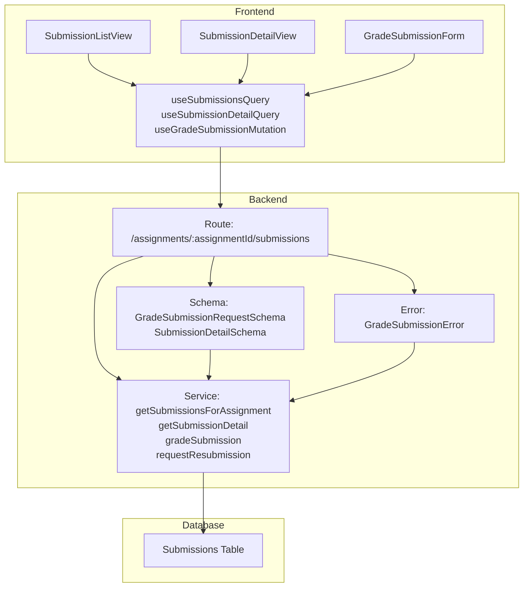

# 과제 채점 & 피드백 기능 모듈화 설계

## 개요
Instructor가 Learner의 과제 제출물을 확인하고, 점수와 피드백을 제공하며, 필요시 재제출을 요청하는 기능을 구현하기 위한 모듈화 설계입니다. 유스케이스 문서(005/spec.md)를 기반으로 기능을 분석하고, 기존 코드베이스의 구조 및 컨벤션에 따라 모듈을 설계합니다.

## 요구사항 분석

### 주요 기능
1. Instructor가 Assignment별 제출물 목록 조회
2. 특정 제출물 상세 정보 확인
3. 점수(0~100) 및 피드백 입력
4. 상태 변경(graded / resubmission_required)
5. 재제출 요청 기능
6. 권한 검증(Instructor가 본인 수업의 과제에만 접근)

### 엣지 케이스
- 점수 범위 초과 입력 검증
- 피드백 미입력 경고
- 권한 없는 과제 접근 제한
- 존재하지 않는 제출물 조회 처리

## 기존 코드베이스 분석

### 관련 모듈 확인
- `src/features/assignment/backend/schema.ts`: Assignment, Submission 관련 Zod 스키마 정의
- `src/features/assignment/backend/service.ts`: 과제 제출 관련 비즈니스 로직
- `src/features/assignment/backend/route.ts`: 과제 관련 API 엔드포인트
- `src/features/assignment/components/AssignmentDetailView.tsx`: 과제 제출 UI
- `src/features/assignment/lib/dto.ts`: 공유 DTO
- `src/features/assignment/hooks/`: React Query 훅

### 기존 구조 분석
- Hono 기반의 백엔드 API 레이어
- Zod를 사용한 입력 검증
- Supabase를 통한 데이터베이스 연동
- React Query를 사용한 프론트엔드 서버 상태 관리
- AGENT.md에 명시된 컨벤션 준수 (Client 컴포넌트, DTO 공유 등)

## 모듈 설계

### 백엔드 모듈

#### 1. Schema (`src/features/assignment/backend/schema.ts`)
- `GradeSubmissionRequestSchema`: 점수, 피드백, 상태(graded/resubmission_required)를 위한 Zod 스키마 추가
- `GetSubmissionsRequestSchema`: 특정 Assignment의 제출물 목록 조회를 위한 파라미터 스키마
- `SubmissionDetailSchema`: 제출물 상세 정보를 위한 응답 스키마 확장

#### 2. Service (`src/features/assignment/backend/service.ts`)
- `getSubmissionsForAssignment`: 특정 Assignment에 대한 제출물 목록 조회
- `getSubmissionDetail`: 특정 제출물의 상세 정보 조회 (Learner 정보 포함)
- `gradeSubmission`: 제출물 채점 및 피드백 저장 (점수, 피드백, 상태 업데이트)
- `requestResubmission`: 재제출 요청 처리 (상태 변경 및 알림 생성)

#### 3. Error (`src/features/assignment/backend/error.ts`)
- `GradeSubmissionError`, `SubmissionNotFoundError`, `UnauthorizedSubmissionAccessError` 등 관련 에러 코드 및 클래스 추가

#### 4. Route (`src/features/assignment/backend/route.ts`)
- `GET /assignments/:assignmentId/submissions`: Assignment별 제출물 목록 조회
- `GET /assignments/:assignmentId/submissions/:submissionId`: 제출물 상세 조회
- `POST /assignments/:assignmentId/submissions/:submissionId/grade`: 제출물 채점

### 프론트엔드 모듈

#### 1. DTO (`src/features/assignment/lib/dto.ts`)
- 새로운 스키마 타입 정의 추가

#### 2. Hooks (`src/features/assignment/hooks/`)
- `useSubmissionsQuery`: Assignment별 제출물 목록 조회 훅
- `useSubmissionDetailQuery`: 제출물 상세 조회 훅
- `useGradeSubmissionMutation`: 제출물 채점 훅

#### 3. Components (`src/features/assignment/components/`)
- `SubmissionListView.tsx`: 제출물 목록 표시 컴포넌트
- `SubmissionDetailView.tsx`: 제출물 상세 및 채점 UI 컴포넌트
- `GradeSubmissionForm.tsx`: 점수 및 피드백 입력 폼 컴포넌트

## 공통 모듈 및 제네릭 고려

- `useGradeSubmissionMutation` 훅은 다른 평가 기능(예: 시험 채점)에 재사용 가능하도록 설계
- DTO를 통해 백엔드 스키마와 프론트엔드 타입을 공유하여 타입 안전성 확보
- Zod 스키마를 재사용하여 입력 검증 로직의 일관성 유지

## Diagram

## Implementation Plan

### 1. 백엔드 스키마 및 서비스 로직
- [ ] `src/features/assignment/backend/schema.ts`에 필요한 Zod 스키마 추가
- [ ] `src/features/assignment/backend/service.ts`에 비즈니스 로직 함수 구현
- [ ] `src/features/assignment/backend/error.ts`에 에러 코드 및 클래스 정의
- [ ] 단위 테스트 작성

### 2. 백엔드 API 라우트
- [ ] `src/features/assignment/backend/route.ts`에 새 엔드포인트 추가
- [ ] 인증/권한 검증 미들웨어 적용
- [ ] API 테스트

### 3. 프론트엔드 DTO 및 훅
- [ ] `src/features/assignment/lib/dto.ts`에 새 타입 추가
- [ ] `src/features/assignment/hooks/useSubmissionsQuery.ts` 구현
- [ ] `src/features/assignment/hooks/useSubmissionDetailQuery.ts` 구현
- [ ] `src/features/assignment/hooks/useGradeSubmissionMutation.ts` 구현
- [ ] 훅 테스트 작성

### 4. 프론트엔드 컴포넌트
- [ ] `src/features/assignment/components/SubmissionListView.tsx` 구현
- [ ] `src/features/assignment/components/SubmissionDetailView.tsx` 구현
- [ ] `src/features/assignment/components/GradeSubmissionForm.tsx` 구현
- [ ] QA 시트 작성 (주요 기능 및 엣지 케이스 테스트 포함)