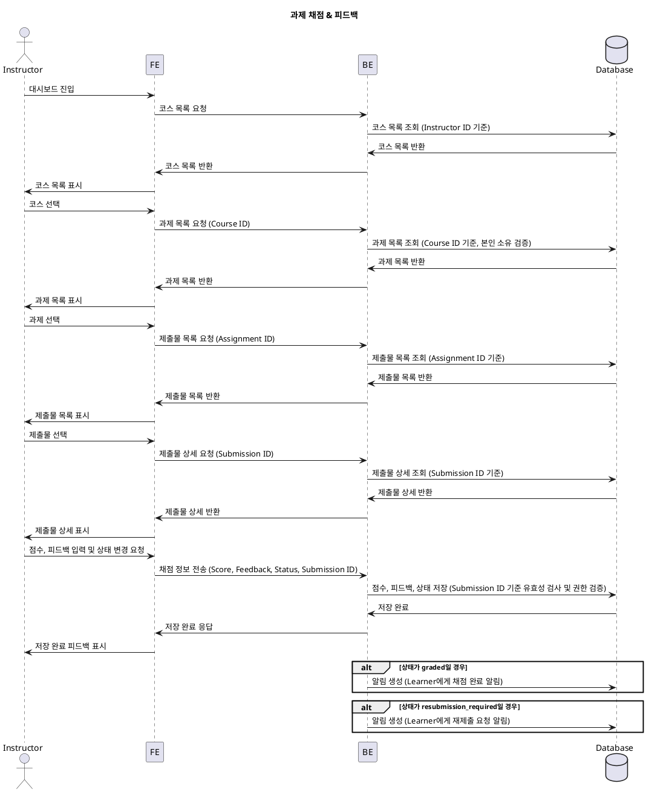

# 과제 채점 & 피드백 유스케이스

## 개요
Instructor가 Learner의 과제 제출물을 확인하고, 점수와 피드백을 제공하며, 필요시 재제출을 요청하는 기능입니다.

## Primary Actor
- Instructor

## Precondition
- Instructor는 로그인 상태이어야 합니다.
- Instructor는 본인이 소유한 코스에 접근할 수 있어야 합니다.
- 해당 코스에 과제(Assignment)가 존재해야 합니다.
- 해당 과제에 Learner의 제출물이 존재해야 합니다.

## Trigger
- Instructor가 대시보드에서 특정 과제의 제출물 목록을 조회할 때.

## Main Scenario
1. Instructor가 대시보드에 접속합니다.
2. Instructor가 본인의 코스 중 하나를 선택합니다.
3. Instructor가 해당 코스의 과제 목록 중 하나를 선택합니다.
4. 시스템은 해당 과제의 제출물 목록을 Instructor에게 표시합니다.
5. Instructor는 특정 제출물(Submission)을 선택합니다.
6. 시스템은 선택된 제출물의 상세 내용을 Instructor에게 표시합니다.
7. Instructor는 점수(0~100)를 입력합니다.
8. Instructor는 피드백 텍스트를 입력합니다.
9. Instructor가 "채점 완료"를 선택하거나, "재제출 요청"을 선택합니다.
10. 시스템은 점수, 피드백, 상태를 저장합니다.
11. 시스템은 Learner에게 채점 완료 또는 재제출 요청 알림을 전달합니다.

## Edge Cases
- **점수 범위 초과 입력**: 0~100 범위를 벗어나는 점수 입력 시 오류 메시지를 표시하고 재입력을 유도합니다.
- **피드백 미입력**: 피드백이 없을 경우 경고 메시지를 표시하되, 채점은 진행합니다.
- **권한 없는 과제 접근**: Instructor가 본인 소유가 아닌 과제에 접근 시 접근이 거부됩니다.
- **존재하지 않는 제출물 조회**: 존재하지 않는 제출물 ID를 통해 접근 시 오류 처리됩니다.

## Business Rules
- Instructor는 본인이 소유한 코스의 과제에 대해서만 채점할 수 있습니다.
- 점수는 0~100 범위로만 입력 가능합니다.
- 채점 시 피드백 입력은 필수입니다.
- 채점 완료 시, 제출물의 상태는 `graded`로 변경됩니다.
- 재제출 요청 시, 제출물의 상태는 `resubmission_required`로 변경되며, Learner는 해당 과제를 다시 제출할 수 있습니다.

## Sequence Diagram
