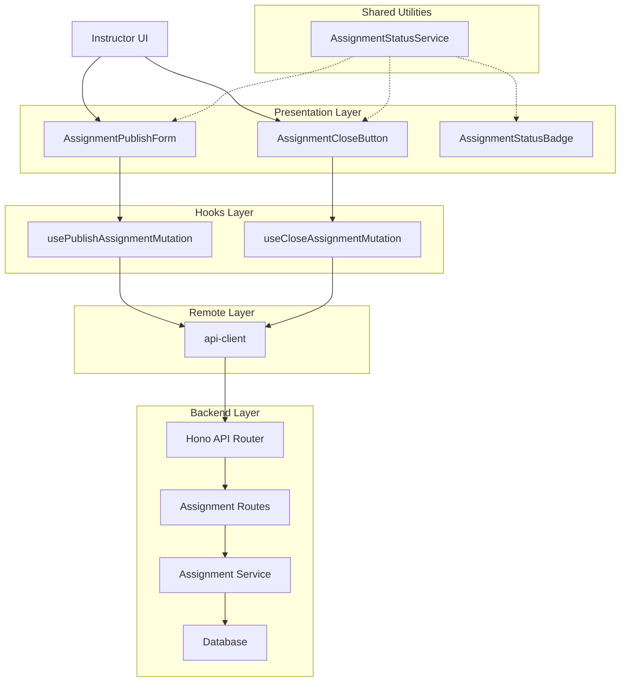

# Assignment 게시/마감 (Instructor) - 모듈화 설계

## 1. 개요

### 모듈 목록

| 모듈 이름 | 위치 | 간략한 설명 |
|----------|------|------------|
| `PublishAssignmentRequestSchema` | `src/features/assignment/backend/schema.ts` | 과제 게시/수정 요청 스키마 |
| `CloseAssignmentRequestSchema` | `src/features/assignment/backend/schema.ts` | 과제 마감 요청 스키마 |
| `publishAssignment` | `src/features/assignment/backend/service.ts` | 과제 게시/수정 비즈니스 로직 |
| `closeAssignment` | `src/features/assignment/backend/service.ts` | 과제 마감 비즈니스 로직 |
| `registerAssignmentPublishCloseRoutes` | `src/features/assignment/backend/route.ts` | 게시/마감 API 엔드포인트 |
| `usePublishAssignmentMutation` | `src/features/assignment/hooks/usePublishAssignmentMutation.ts` | 과제 게시/수정 React Query 훅 |
| `useCloseAssignmentMutation` | `src/features/assignment/hooks/useCloseAssignmentMutation.ts` | 과제 마감 React Query 훅 |
| `AssignmentPublishForm` | `src/features/assignment/components/AssignmentPublishForm.tsx` | 과제 게시/수정 폼 UI 컴포넌트 |
| `AssignmentCloseButton` | `src/features/assignment/components/AssignmentCloseButton.tsx` | 과제 마감 버튼 UI 컴포넌트 |
| `AssignmentStatusBadge` | `src/features/assignment/components/AssignmentStatusBadge.tsx` | 과제 상태 표시 UI 컴포넌트 |
| `AssignmentStatusService` | `src/features/assignment/lib/assignmentStatusService.ts` | 과제 상태 관련 공통 유틸리티 함수 |

## 2. Diagram



## 3. Implementation Plan

### 3.1 Backend Implementation

#### 3.1.1 Schema (`src/features/assignment/backend/schema.ts`)

Add new schemas for assignment publishing and closing:

- `PublishAssignmentRequestSchema`: Validates assignment creation/update data
- `CloseAssignmentRequestSchema`: Validates assignment closing data
- Update `AssignmentStatus` enum if needed

Unit tests for schema validation:
```typescript
// Validate assignment publishing data
expect(PublishAssignmentRequestSchema.parse(validData)).toBeDefined();

// Test validation errors
expect(() => PublishAssignmentRequestSchema.parse(invalidData)).toThrow();

// Test assignment closing schema validation
expect(CloseAssignmentRequestSchema.parse(validData)).toBeDefined();
```

#### 3.1.2 Service (`src/features/assignment/backend/service.ts`)

Add new service functions:

- `publishAssignment`: Handles assignment creation/publishing logic
  - Validates instructor ownership
  - Checks assignment data integrity
  - Updates status from draft to published
  - Returns updated assignment info

- `closeAssignment`: Handles assignment closing logic
  - Validates instructor ownership
  - Checks if assignment is in valid state for closing
  - Updates status from published to closed
  - Returns updated assignment info
  
- `updateAssignmentStatus`: Helper function to update assignment status

Unit tests for service functions:
```typescript
// Test successful assignment publishing
test('should publish assignment successfully', async () => {
  const result = await publishAssignment(supabase, instructorId, validData);
  expect(result.status).toBe('published');
});

// Test assignment closing
test('should close assignment successfully', async () => {
  const result = await closeAssignment(supabase, instructorId, assignmentId);
  expect(result.status).toBe('closed');
});

// Test unauthorized access
test('should throw error for unauthorized access', async () => {
  await expect(publishAssignment(supabase, wrongInstructorId, validData))
    .rejects.toThrow(AssignmentError);
});

// Test invalid status transitions
test('should prevent invalid status transitions', async () => {
  await expect(closeAssignment(supabase, instructorId, draftAssignmentId))
    .rejects.toThrow(AssignmentError);
});
```

#### 3.1.3 Routes (`src/features/assignment/backend/route.ts`)

Add new API endpoints:

- `POST /assignments/:assignmentId/publish`: Publish assignment endpoint
- `POST /assignments/:assignmentId/close`: Close assignment endpoint
- `PUT /assignments`: Update assignment endpoint (includes publishing)

Error handling for:
- Unauthorized access
- Invalid assignment data
- Status transition violations
- Assignment not found

#### 3.1.4 Errors (`src/features/assignment/backend/error.ts`)

Add new error codes for status transitions:

- `AssignmentErrorCode.INVALID_STATUS_TRANSITION`: For invalid state changes
- `AssignmentErrorCode.ASSIGNMENT_ALREADY_PUBLISHED`: For attempt to publish published assignment
- `AssignmentErrorCode.ASSIGNMENT_ALREADY_CLOSED`: For attempt to close closed assignment

### 3.2 Frontend Implementation

#### 3.2.1 Hooks (`src/features/assignment/hooks/`)

Create new React Query hooks:

- `usePublishAssignmentMutation.ts`: Handles assignment publishing mutation
  - Updates cache after successful publishing
  - Handles optimistic updates
  - Provides error handling

- `useCloseAssignmentMutation.ts`: Handles assignment closing mutation
  - Updates cache after successful closing
  - Provides error feedback to UI

QA test checklist for hooks:
- Verify successful API calls trigger cache invalidation
- Confirm error states are properly handled
- Test loading states are correctly displayed
- Validate that unauthorized access is handled gracefully

#### 3.2.2 Components (`src/features/assignment/components/`)

Create new UI components:

- `AssignmentPublishForm.tsx`: Form for creating/editing assignments
  - Includes fields for title, description, due date, weight, etc.
  - Status selection (draft/publish)
  - Validation for required fields
  - Error display for validation failures

- `AssignmentCloseButton.tsx`: Button for closing assignments
  - Disables when assignment is already closed
  - Shows confirmation dialog before closing
  - Visual feedback during processing

- `AssignmentStatusBadge.tsx`: Status indicator component
  - Displays assignment status with color coding
  - Shows different styles for draft/published/closed states

QA test checklist for components:
- Verify all form validations work correctly
- Test different assignment status displays
- Confirm UI shows appropriate loading states
- Validate error messages are displayed properly
- Test responsive design across different screen sizes
- Verify accessibility features (keyboard navigation, screen readers)

### 3.3 Shared Utilities

Create utility module:

- `assignmentStatusService.ts`: Contains shared logic for:
  - Status transition validation
  - Status display formatting
  - Due date validation logic
  - Permission checks

## 4. Auto-closing Service

For automatic assignment closing when deadline is reached, consider implementing a background service:

- `src/backend/services/assignmentDeadlineService.ts`
- This could be a scheduled service that checks due dates and automatically closes assignments

## 5. Security & Validation

- Ensure instructors can only publish/close assignments in their own courses
- Validate all input data before database operations
- Implement proper error handling for edge cases
- Add logging for security-related events