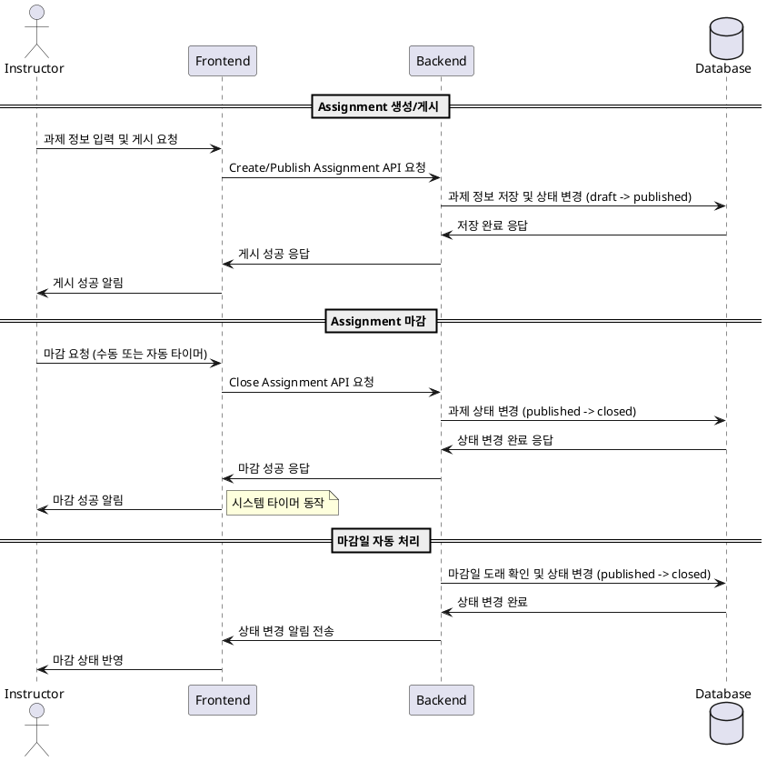

# Feature 6: Assignment 게시/마감 (Instructor)

## Primary Actor
- Instructor (강사)

## Precondition (사용자 관점에서만)
- Instructor는 시스템에 로그인되어 있어야 한다.
- Instructor는 자신이 소유한 코스에 접근 권한을 가지고 있어야 한다.
- Instructor는 게시할 Assignment 내용(제목, 설명, 마감일 등)을 준비했어야 한다.

## Trigger
- Instructor가 코스 관리 대시보드에서 "과제 생성/수정" 기능을 선택할 때
- Instructor가 이미 생성된 Draft 상태의 과제를 "게시하기" 버튼으로 게시할 때
- 마감일이 도래하여 시스템이 자동으로 Assignment 상태를 변경할 때
- Instructor가 수동으로 Assignment를 "마감하기" 버튼으로 마감할 때

## Main Scenario

### 1. Assignment 생성/수정 및 게시
1. Instructor가 자신의 코스 관리 페이지에 접근한다.
2. Instructor가 "새 과제 추가" 또는 기존 과제 수정 버튼을 클릭한다.
3. Instructor가 과제 정보(제목, 설명, 마감일, 점수 비중 등)를 입력한다.
4. Instructor가 "저장" 또는 "게시" 버튼을 클릭한다.
5. 시스템은 입력된 정보를 유효성 검사한다.
6. 시스템은 과제를 Draft 상태에서 Published 상태로 변경한다.
7. 시스템은 게시된 과제를 학습자들이 볼 수 있도록 목록에 표시한다.

### 2. Assignment 마감
1. Instructor가 코스 관리 페이지에 접근한다.
2. Instructor가 게시된 과제 목록에서 마감할 과제를 선택한다.
3. Instructor가 "마감하기" 버튼을 클릭하거나, 시스템이 마감일 도래 시 자동으로 마감 처리한다.
4. 시스템은 Assignment 상태를 Published에서 Closed 상태로 변경한다.
5. 시스템은 과제 제출 기능을 비활성화하고, 채점 기능만 활성화한다.
6. 시스템은 Learner 화면에서 마감 상태를 반영한다.

## Edge Cases
- Instructor가 권한 없는 코스의 과제를 게시/마감하려는 경우: 접근 오류 발생
- 유효하지 않은 과제 정보(예: 마감일이 과거인 경우)를 입력한 경우: 유효성 검사 실패
- 시스템 시간 오류로 인한 마감일 자동 처리 실패: 수동 마감 기능 제공
- 네트워크 오류로 인한 게시/마감 요청 실패: 재시도 기능 제공
- 동시에 여러 Instructor가 동일한 과제를 변경하려는 경우: 동시성 충돌 처리

## Business Rules
- 과제 상태는 Draft → Published → Closed 순으로만 전환 가능하다.
- Instructor는 본인이 소유한 코스에 대해서만 과제를 생성/게시/마감할 수 있다.
- 과제가 게시(Published) 상태일 때만 학습자가 과제를 열람할 수 있다.
- 과제가 마감(Closed) 상태일 때는 제출이 불가능하며, 채점만 가능하다.
- 마감일이 지나면 자동으로 과제가 마감 상태로 전환되어야 한다.
- 동일한 코스 내에서 동일한 제목의 과제는 중복 생성될 수 없다.
- 과제 정보에는 반드시 마감일이 포함되어야 한다.

## Sequence Diagram

