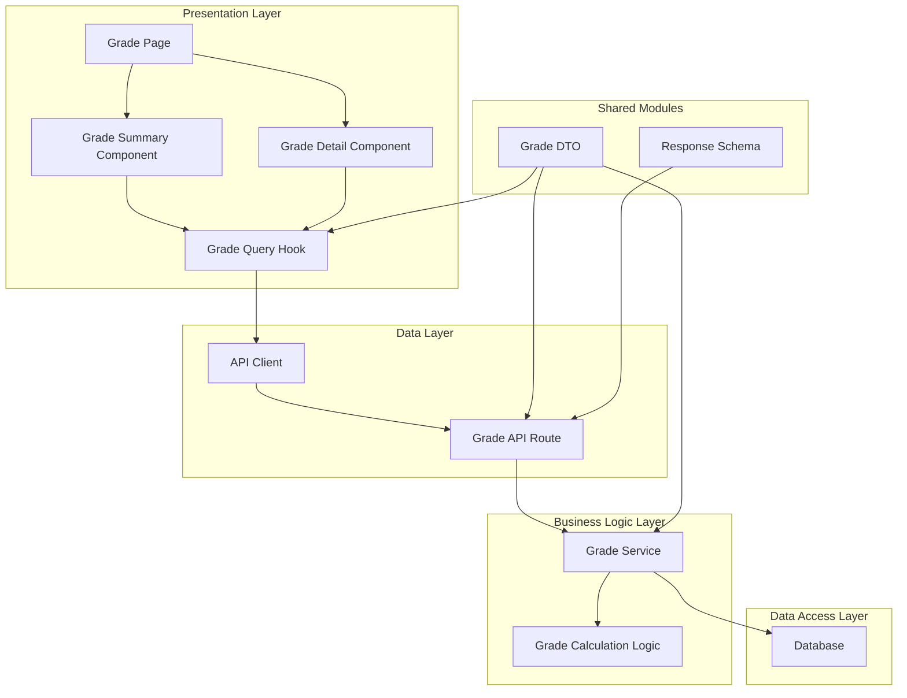

# 7. 성적 & 피드백 열람 (Learner) - Implementation Plan

## 개요

### 1. Grade Summary Module
- **설명**: 사용자의 과제 성적 요약 정보를 표시하는 모듈
- **위치**: `src/features/grade/components/GradeSummary.tsx`
- **기능**: 전체 코스별 총점 및 과제별 성적 요약을 표시

### 2. Grade Detail Module
- **설명**: 사용자의 과제별 성적 상세 정보를 표시하는 모듈
- **위치**: `src/features/grade/components/GradeDetail.tsx`
- **기능**: 각 과제의 점수, 상태(제출됨/지각/graded/재제출요청), 피드백 등을 표시

### 3. Grade Calculation Module
- **설명**: 사용자의 성적을 계산하는 비즈니스 로직 모듈
- **위치**: `src/features/grade/lib/calculateGrade.ts`
- **기능**: 각 과제 점수 × 비중 합산을 통한 총점 계산

### 4. Grade API Module
- **설명**: 성적 및 피드백 조회 관련 API 엔드포인트를 제공하는 모듈
- **위치**: 
  - Backend: `src/features/grade/backend/route.ts`
  - Frontend: `src/features/grade/lib/api.ts`

### 5. Grade DTO Module
- **설명**: 성적 관련 데이터 전송 객체
- **위치**: `src/features/grade/lib/dto.ts`
- **기능**: 과제별 성적, 코스별 총점 등 데이터 구조 정의

### 6. Grade Service Module
- **설명**: 성적 조회 및 계산 비즈니스 로직
- **위치**: `src/features/grade/backend/service.ts`
- **기능**: 사용자별 성적 정보 조회, 총점 계산

### 7. Grade Query Hook Module
- **설명**: 성적 정보를 조회하는 React Query 훅
- **위치**: `src/features/grade/hooks/useGradeQuery.ts`
- **기능**: 성적 정보를 캐싱 및 관리

### 8. Grade Page Module
- **설명**: 사용자의 전체 성적 페이지
- **위치**: `src/app/my/grades/page.tsx`
- **기능**: 사용자가 자신의 성적 및 피드백을 열람할 수 있는 페이지

## Diagram



## Implementation Plan

### 1. Grade DTO Module
- **위치**: `src/features/grade/lib/dto.ts`
- **내용**: 
  - `GradeSummaryResponse` (코스별 총점)
  - `GradeDetailResponse` (과제별 성적 상세)
  - `AssignmentGrade` (개별 과제 성적 정보)
- **Unit Test**: 
  ```ts
  describe('Grade DTO', () => {
    test('should validate grade summary response structure', () => {
      // Test validation
    });
    
    test('should validate grade detail response structure', () => {
      // Test validation
    });
  });
  ```

### 2. Grade Calculation Module
- **위치**: `src/features/grade/lib/calculateGrade.ts`
- **내용**: 
  - `calculateCourseTotalScore` (코스별 총점 계산)
  - `calculateAssignmentWeightedScore` (과제별 가중치 점수 계산)
- **Unit Test**:
  ```ts
  describe('calculateCourseTotalScore', () => {
    test('should calculate total score correctly', () => {
      const assignments = [
        { score: 80, weight: 50 },
        { score: 90, weight: 50 }
      ];
      const result = calculateCourseTotalScore(assignments);
      expect(result).toBe(85); // (80*0.5 + 90*0.5)
    });
    
    test('should handle empty assignments', () => {
      const result = calculateCourseTotalScore([]);
      expect(result).toBe(0);
    });
    
    test('should handle weight sum not equal to 100', () => {
      const assignments = [
        { score: 80, weight: 30 },
        { score: 90, weight: 40 }
      ];
      const result = calculateCourseTotalScore(assignments);
      expect(result).toBeCloseTo(84.71); // (80*30 + 90*40) / (30+40)
    });
  });
  ```

### 3. Grade Schema Module
- **위치**: `src/features/grade/backend/schema.ts`
- **내용**:
  - Zod 스키마 정의
  - Request/Response 스키마
  - 유효성 검사

### 4. Grade Service Module
- **위치**: `src/features/grade/backend/service.ts`
- **내용**:
  - `getLearnerGrades` (사용자 성적 전체 조회)
  - `getCourseGrades` (특정 코스 성적 조회)
  - `getAssignmentGrade` (특정 과제 성적 조회)
- **Unit Test**:
  ```ts
  describe('Grade Service', () => {
    test('should return learner\'s grades', async () => {
      const mockSupabase = createMockSupabase();
      const grades = await getLearnerGrades(mockSupabase, 'user-id');
      expect(grades).toBeDefined();
      expect(grades.length).toBeGreaterThan(0);
    });
    
    test('should validate user access permissions', async () => {
      const mockSupabase = createMockSupabase();
      await expect(getLearnerGrades(mockSupabase, 'other-user-id'))
        .rejects
        .toThrow('Unauthorized access');
    });
  });
  ```

### 5. Grade API Module
- **위치**: 
  - `src/features/grade/backend/route.ts`
  - `src/features/grade/lib/api.ts`
- **내용**:
  - `/api/grades` - 전체 성적 조회
  - `/api/grades/courses/:courseId` - 특정 코스 성적 조회
  - `/api/grades/assignments/:assignmentId` - 특정 과제 성적 조회
- **QA Sheet**:
  ```ts
  // API Integration Tests
  describe('Grade API', () => {
    test('GET /api/grades returns user\'s grades', async () => {
      // Test authenticated request
      // Test response structure
      // Test error handling (unauthenticated, etc.)
    });
    
    test('GET /api/grades/courses/:courseId returns course grades', async () => {
      // Test with valid course ID
      // Test with invalid course ID
      // Test access control
    });
    
    test('should handle edge cases', async () => {
      // Test when user has no grades
      // Test when database is down
      // Test invalid user ID
    });
  });
  ```

### 6. Grade Query Hook Module
- **위치**: `src/features/grade/hooks/useGradeQuery.ts`
- **내용**:
  - `useGradeSummaryQuery` (성적 요약 쿼리)
  - `useGradeDetailQuery` (성적 상세 쿼리)
- **Test**:
  ```ts
  describe('useGradeSummaryQuery', () => {
    test('should fetch grade summary successfully', async () => {
      const { result } = renderHook(() => useGradeSummaryQuery());
      await waitFor(() => expect(result.current.isSuccess).toBe(true));
      expect(result.current.data).toBeDefined();
    });
    
    test('should handle error state', async () => {
      // Mock API failure
      const { result } = renderHook(() => useGradeSummaryQuery());
      await waitFor(() => expect(result.current.isError).toBe(true));
    });
  });
  ```

### 7. Grade Components
- **위치**: 
  - `src/features/grade/components/GradeSummary.tsx`
  - `src/features/grade/components/GradeDetail.tsx`
- **내용**:
  - Responsive 디자인
  - 상태 표시 (제출됨/지각/graded/재제출요청)
  - 피드백 표시
- **QA Sheet**:
  ```ts
  // Component Testing
  describe('Grade Summary Component', () => {
    test('should render grade summary correctly', () => {
      const { getByText } = render(<GradeSummary grades={mockData} />);
      expect(getByText('Course Title')).toBeInTheDocument();
      expect(getByText('Total Score: 85')).toBeInTheDocument();
    });
    
    test('should handle loading state', () => {
      render(<GradeSummary isLoading={true} />);
      expect(getByText('Loading...')).toBeInTheDocument();
    });
    
    test('should handle empty state', () => {
      render(<GradeSummary grades={[]} />);
      expect(getByText('No grades available')).toBeInTheDocument();
    });
  });
  ```

### 8. Grade Page Module
- **위치**: `src/app/my/grades/page.tsx`
- **내용**:
  - 페이지 레이아웃
  - 컴포넌트 조합
  - 오류 처리
- **QA Sheet**:
  ```ts
  // Page Integration Test
  describe('Grade Page', () => {
    test('should render grade summary and detail', async () => {
      render(<GradePage />);
      await waitFor(() => {
        expect(screen.getByText('My Grades')).toBeInTheDocument();
        expect(screen.getByTestId('grade-summary')).toBeInTheDocument();
      });
    });
    
    test('should handle unauthorized access', async () => {
      // Mock unauthenticated user
      render(<GradePage />);
      expect(screen.getByText('Please log in')).toBeInTheDocument();
    });
  });
  ```