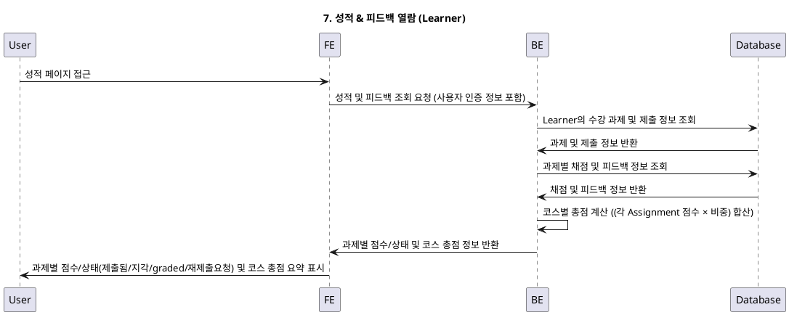

# 7. 성적 & 피드백 열람 (Learner) - Use Case Specification

## Primary Actor
Learner (수강생)

## Precondition
- 사용자는 로그인된 상태이어야 한다.
- 사용자는 Learner 역할로 등록되어 있어야 한다.
- 사용자는 해당 과제에 대해 수강 신청을 한 상태이어야 한다.
- 사용자는 해당 과제에 대해 제출을 완료한 상태이어야 한다.
- 해당 과제는 이미 채점된 상태이어야 한다.

## Trigger
Learner가 성적 및 피드백을 열람하기 위해 성적 페이지에 접근할 때

## Main Scenario
1. Learner가 성적 페이지를 요청한다.
2. 시스템은 Learner의 인증 정보를 확인한다.
3. 시스템은 해당 Learner가 수강한 코스와 과제 목록을 조회한다.
4. 시스템은 각 과제에 대한 제출물과 채점 정보를 조회한다.
5. 시스템은 과제별 점수, 지각 여부, 재제출 여부, 피드백을 정리한다.
6. 시스템은 코스별 총점 계산: (각 Assignment 점수 × 비중) 합산
7. 시스템은 과제별 점수/상태(제출됨/지각/graded/재제출요청)와 코스 총점 요약을 표시한다.

## Edge Cases
- **인증 실패**: 사용자가 로그인하지 않은 경우 로그인 페이지로 리다이렉션
- **권한 없음**: 사용자가 해당 과제에 접근할 권한이 없는 경우 접근 거부
- **데이터 없음**: 채점된 과제가 없는 경우 빈 목록 표시 안내
- **점수 미확정**: 채점이 완료되지 않은 과제의 경우 "채점 중" 상태 표시
- **계산 오류**: 총점 계산 시 오류 발생 시 오류 메시지 표시

## Business Rules
- Learner는 본인 제출물만 조회할 수 있다.
- 과제별 점수는 0~100점 범위이다.
- 코스 총점은 (각 Assignment 점수 × 비중)의 합산으로 계산된다.
- 채점되지 않은 과제는 점수 표기 없이 상태만 표시된다.
- 지각 여부와 재제출 여부가 점수에 영향을 미칠 수 있다.

## Sequence Diagram

